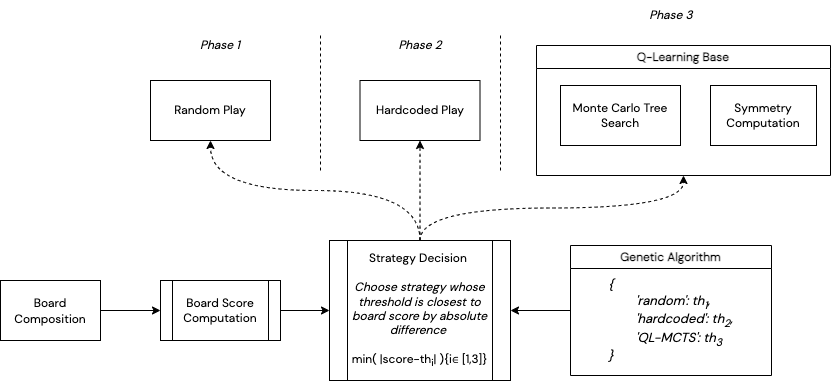

# Chad Quarto Player

Sidharrth Nagappan, 2023

> Still reworking repository, not completed yet

### Player

### Repository Structure

- `DeepQNetwork` generates a deep Q-network that can be trained to play Quarto
- `GeneticAlgorithm` uses Genetic Algorithm to decide score thresholds for the hybrid player
- `MCTS` contains the Monte Carlo Tree Search algorithm
- `lib` contains my utility functions, such as board transformation and scoring functions
- `misc` for junk
- `QLMCTS` contains a QL-agent backed by MCTS
- `quarto` contains the Quarto game logic (Calabrese's class, my child class and custom OpenAI Gym environment)
- `report` contains the report for this project